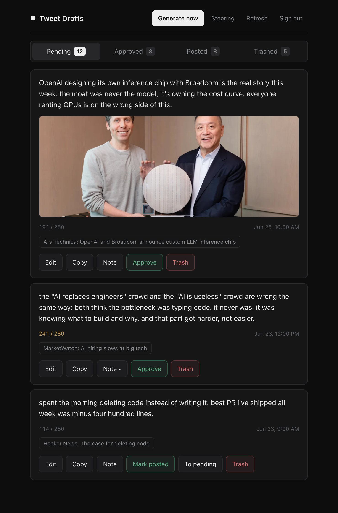
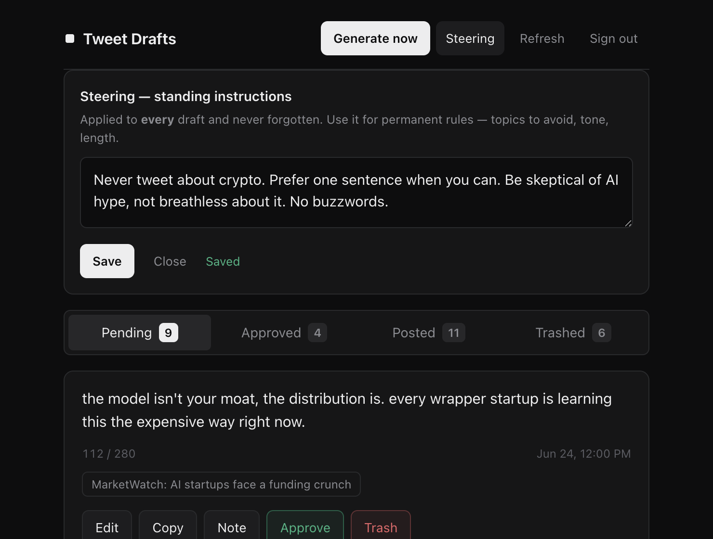

# Tweet Draft Generator

A personal AI writing assistant that reacts to **real, current news** in your
interest areas and drafts tweets in your voice. You review the drafts in a clean
web UI — approve, edit, trash — and the system learns your taste over time. Runs
entirely on free tiers with **no server to manage**.

> **Stack:** React + TypeScript (Vite) · Python serverless function · Supabase
> (Postgres + Auth + Cron) · Gemini 2.5 Flash · deployed on Vercel.



---

## How it works

```
Supabase Cron (scheduled, free)     ──POST {mode:single}─┐
"Generate now" button (your login)  ──POST {mode:spread}─┤
                                                         ▼
                              Vercel Python function  (api/generate.py)
                                1. fetch fresh news (HN, Google News, MarketWatch, CNBC)
                                2. load your taste signals (approved / trashed / notes / steering)
                                3. pick stories → Gemini writes takes → keep all that pass validation
                                4. attach a relevant article photo when one exists (Microlink)
                                                         │
                                                         ▼
                                       Supabase  tweet_drafts  (Postgres + RLS)
                                                         ▲
                                                         │  review / approve / edit / note / mark posted
                                       React UI on Vercel  (magic-link auth)
```

## Engineering highlights

- **News-grounded, not hallucinated.** An LLM asked for "a hot take" will invent
  or staleify news. Instead, every draft reacts to a *real* item fetched seconds
  earlier from multiple sources, with a **hard 30-hour freshness cap** and
  newest-first ranking — so drafts are always about what's actually happening now.
- **Fail-soft ingestion.** Each news source is independent: if a feed is down,
  rate-limited, or malformed, it's skipped with a log line instead of crashing the
  run. Hacker News + Google News carry the load when Reddit blocks datacenter IPs.
- **Rich previews, filtered.** Each draft is enriched with the source article's
  preview image via **Microlink** (which resolves Google News redirect links to the
  real article), then **filtered by dimensions and aspect ratio** to keep only real
  story photos — never logos, avatars, or icons. Fetched once per story, fail-soft.
- **A feedback loop that learns your voice.** Approvals become "write more like
  these," trashes become "avoid these," in-card edits teach exact phrasing, and a
  persistent **Steering** field holds standing rules ("never tweet about crypto").
  All injected into the prompt — in-context learning, no fine-tuning required.
- **Serverless and free.** No always-on process: generation is a Vercel Python
  function triggered by Supabase Cron (scheduled) and the UI button (on-demand,
  synchronous so drafts appear in ~10s). Gemini's free tier covers the volume.
- **Security by construction.** The database is locked down with **Row Level
  Security** scoped to the owner's email; the public anon key in the frontend is
  safe *only* because of it. Service keys and API keys live exclusively in
  server-side env vars; the generate endpoint verifies the caller is the owner
  (via their Supabase token) or the cron (via a shared secret).
- **Resilience built in.** LLM calls retry transient errors with backoff; a single
  failed story is skipped without sinking a multi-topic batch; "thinking" is
  disabled on the model since it only adds latency to short-form writing.
- **Provider-abstracted.** Swap Gemini for Groq by changing one constant — the
  REST calls are written by hand (no SDKs) so a dependency bump can't break the cron.



## Notable design decisions

- **DB-cron over CI-cron.** Scheduled generation runs on Supabase's `pg_cron`
  hitting the serverless function, rather than a CI runner. This sidesteps CI
  scheduling jitter and billing limits entirely, and reuses the *exact same* code
  path as the on-demand button — one endpoint, two callers.
- **DST handled in code, not the schedule.** The cron fires hourly in UTC; the
  function gates to the author's local waking hours using a timezone-aware clock,
  so daylight saving never requires touching the schedule.
- **Human-in-the-loop, not auto-post.** The system drafts; the person decides. It
  never posts to X — it produces a review queue, which is both safer and the source
  of the training signal.

---

## Run your own

### 1. Supabase
Run [`supabase/schema.sql`](supabase/schema.sql) then
[`supabase/settings.sql`](supabase/settings.sql) in the SQL Editor (creates the
tables, indexes, and RLS — set your email in the policies). Enable Email (magic
link) auth, and copy your Project URL + `anon` + `service_role` keys.

### 2. Deploy to Vercel
Import the repo, set **Root Directory = `ui`**, and add the env vars from
[`.env.example`](.env.example) (Gemini key, Supabase URL + keys, `OWNER_EMAIL`, a
random `CRON_SECRET`, and an optional `AUTHOR_PROFILE` describing whose voice to
write in). Set the Supabase auth redirect to your Vercel domain.

### 3. Schedule generation
Fill your domain + `CRON_SECRET` into [`supabase/cron.sql`](supabase/cron.sql) and
run it — a `pg_cron` job calls the function on a schedule (the function gates to its
active hours in code, so daylight saving needs no maintenance).

Local generator testing (no deploy needed):
```bash
cd ui && python3 -m venv .venv && source .venv/bin/activate
pip install -r requirements.txt
export GEMINI_API_KEY=...
python api/generate.py --dry-run --mode spread   # prints takes, writes nothing
```

## Project structure
```
ui/api/generate.py     self-contained generator + authenticated serverless function
ui/src/                React + Vite review UI (auth, tabs, inline edit, steering)
ui/requirements.txt    Python deps for the function
supabase/schema.sql    tables + RLS + indexes
supabase/settings.sql  steering store
supabase/cron.sql      scheduled pg_cron job
tests/test_generate.py unit tests for the pure logic (pytest)
```

## Tests
```bash
pip install -r ui/requirements.txt pytest && pytest
```
24 unit tests covering candidate validation, dedup, topic routing, the image-relevance
filter, and prompt assembly — all pure logic, no network or API keys required.

## License

MIT — see [LICENSE](LICENSE).
